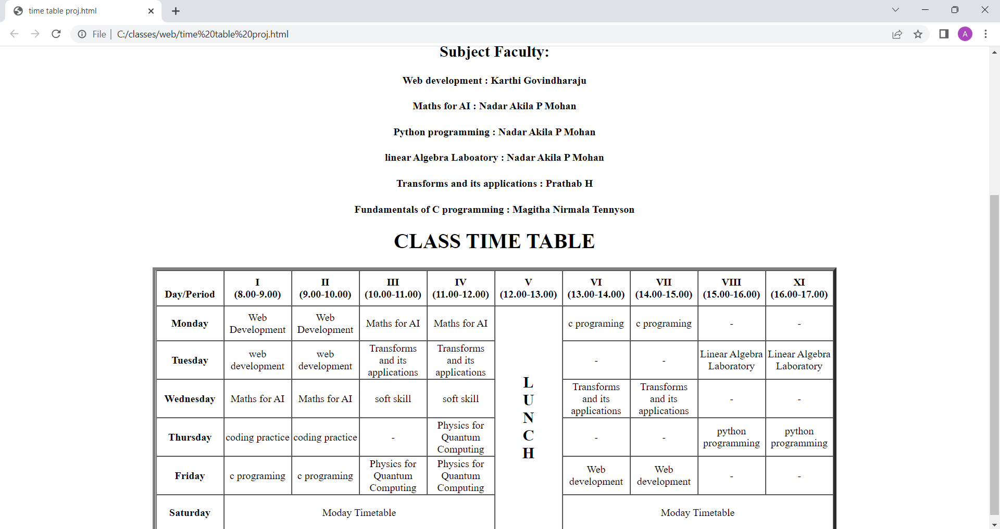

# Experiment_Time_Table

## AIM
To Write a html webpage page to display your timetable.

# ALGORITHM
### STEP 1
create a simple table using table tag
### STEP 2
Add header row using th tag
### STEP 3
Add your timetable
### STEP 4
Execute the program

# CODE
```<!DOCTYPE html>
<html>

<body>
<h1 align="center">SAVEETHA ENGINEERING COLLEGE</h1>
<h2 align="center">Name            : Karthikeyan.R</h2>
<h2 align="center">Ref no          : 22009322</h2>
<h2 align="center">Dep             : AI-Ml</h2>
<h2 align="center">College code    : 2122</h2>
<h2 align="center">Slot            : 6C1-1</h2>
	<table border="5" cellspacing="0" align="center">
		<!--<caption>Timetable</caption>-->
		<tr>
			<td align="center" height="50"
				width="100"><br>
				<b>Day/Period</b></br>
			</td>
			<td align="center" height="50"
				width="100">
				<b>I<br>(8.00-9.00)</b>
			</td>
			<td align="center" height="50"
				width="100">
				<b>II<br>(9.00-10.00)</b>
			</td>
			<td align="center" height="50"
				width="100">
				<b>III<br>(10.00-11.00)</b>
			</td>
			<td align="center" height="50"
				width="100">
				<b>IV<br>(11.00-12.00)</b>
			</td>
			<td align="center" height="50"
				width="100">
				<b>V<br>(12.00-13.00)</b>
			</td>
			<td align="center" height="50"
				width="100">
				<b>VI<br>(13.00-14.00)</b>
			</td>
			<td align="center" height="50"
				width="100">
				<b>VII<br>(14.00-15.00)</b>
			</td>
			<td align="center" height="50"
				width="100">
				<b>VIII<br>(15.00-16.00)</b>
			</td>
            <td align="center" height="50"
				width="100">
				<b>XI<br>(16.00-17.00)</b>
			</td>
		</tr>
		<tr>
			<td align="center" height="50">
				<b>Monday</b></td>
			<td align="center" height="50">Web Development</td>
			<td align="center" height="50">Web Development</td>
			<td align="center" height="50">Maths for AI</td>
            <td align="center" height="50">Maths for AI</td>
			<td rowspan="6" align="center" height="50">
				<h2>L<br>U<br>N<br>C<br>H</h2>
			</td>
			<td align="center" height="50">c programing</td>
			<td align="center" height="50">c programing</td>
            <td align="center" height="50">-</td>
            <td align="center" height="50">-</td>
		</tr>
		<tr>
			<td align="center" height="50">
				<b>Tuesday</b>
			</td>
			</td>
			<td align="center" height="50">web development</td>
			<td align="center" height="50">web development</td>
			<td align="center" height="50">Transforms and its applications</td>
			<td align="center" height="50">Transforms and its applications</td>
            <td align="center" height="50">-</td>
            <td align="center" height="50">-</td>
            <td align="center" height="50">Linear Algebra Laboratory</td>
            <td align="center" height="50">Linear Algebra Laboratory</td>

		</tr>
		<tr>
			<td align="center" height="50">
				<b>Wednesday</b>
			</td>
			<td align="center" height="50">Maths for AI</td>
			<td align="center" height="50">Maths for AI</td>
			<td align="center" height="50">soft skill</td>
			<td align="center" height="50">soft skill</td>
			<td align="center" height="50">Transforms and its applications</td>
			<td align="center" height="50">Transforms and its applications</td>
            <td align="center" height="50">-</td>
            <td align="center" height="50">-</td>


			</td>
		</tr>
		<tr>
			<td align="center" height="50">
				<b>Thursday</b>
			</td>
			<td align="center" height="50">coding practice</td>
			<td align="center" height="50">coding practice</td>
			<td align="center" height="50">-</td>
            <td align="center" height="50">Physics for Quantum Computing</td>
			<td align="center" height="50">-</td>
            <td align="center" height="50">-</td>
			<td align="center" height="50">python programming</td>
			<td align="center" height="50">python programming</td>
		</tr>
		<tr>
			<td align="center" height="50">
				<b>Friday</b>
			</td>
			
			<td align="center" height="50">c programing</td>
			<td align="center" height="50">c programing</td>
			<td align="center" height="50">Physics for Quantum Computing</td>
			<td align="center" height="50">Physics for Quantum Computing</td>
			<td align="center" height="50">Web development</td>
			<td align="center" height="50">Web development</td>
			<td align="center" height="50">-</td>
			<td align="center" height="50">-</td>
		</tr>
		<tr>
			<td align="center" height="50">
				<b>Saturday</b>
			</td>
			<td colspan="4" align="center"
				height="50">Moday Timetable
			</td>
			<td colspan="4" align="center"
				height="50">Moday Timetable
			</td>

			
		</tr>
<h2 align="center">Subject Faculty:</h4>
<h4 align="center">Web development      :   Karthi Govindharaju</h2>
<h4 align="center">Maths for AI         :   Nadar Akila P Mohan </h4>
<h4 align="center">Python programming   :   Nadar Akila P Mohan</h4>
<h4 align="center">linear Algebra Laboatory  : Nadar Akila P Mohan</h4>
<h4 align="center">Transforms and its applications   :  Prathab H</h4>
<h4 align="center">Fundamentals of C programming   :  Magitha Nirmala Tennyson </h4>

<h1 align="center">CLASS TIME TABLE</h2>

	</table>
</body>

</html>
```
# OUPUT

## Result
The HTML code executed successfully.